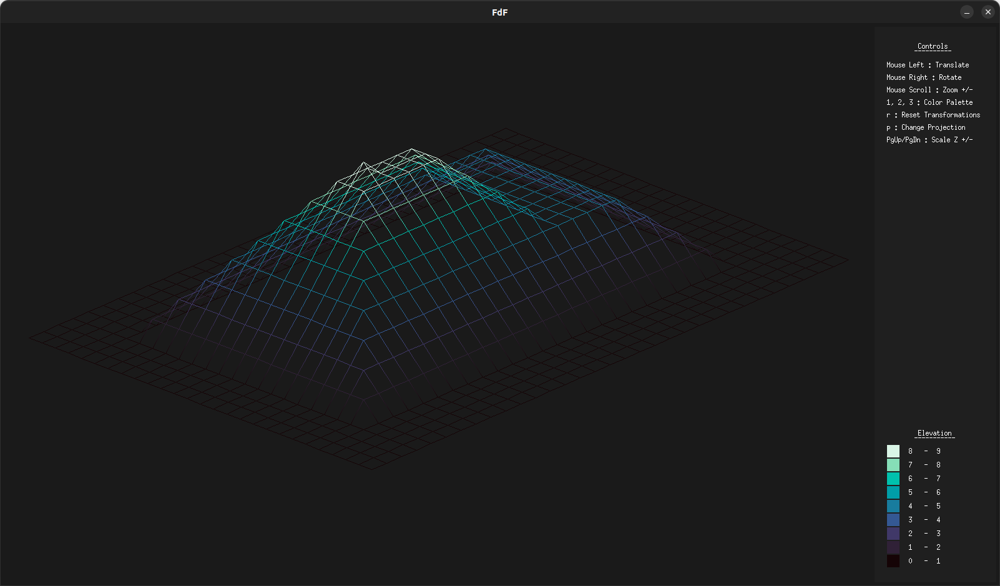
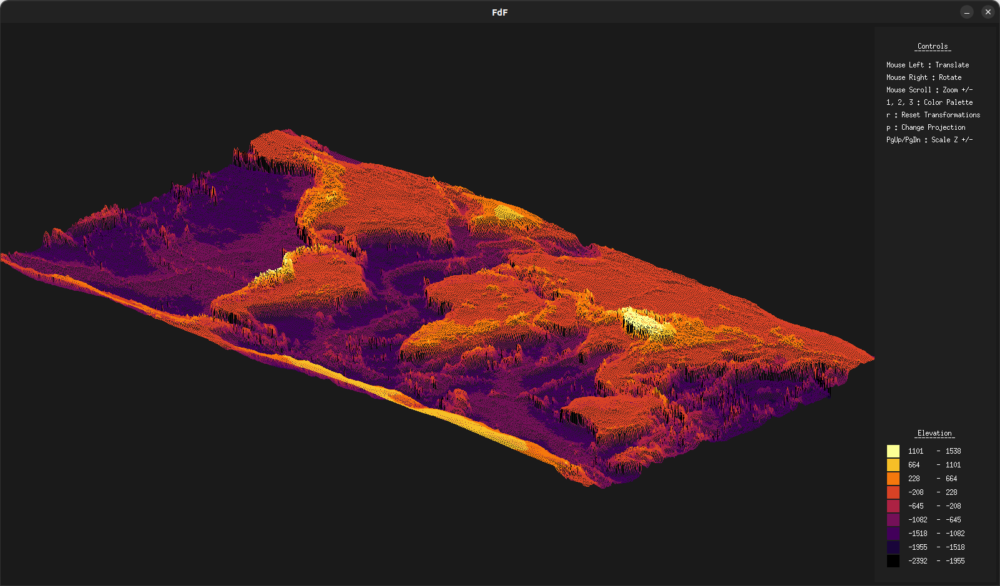
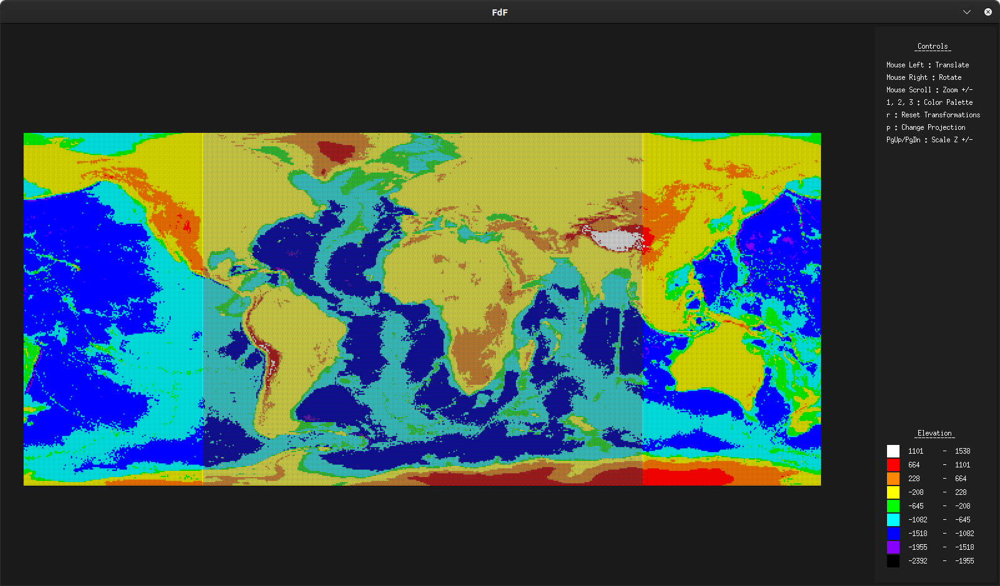

# FdF

This 42 Common Core project is my initial dive into graphics programming.
The aim of FdF is to visualize elevation maps using 3D wireframe rendering.

## Overview

## Build

### Dependencies

- [MinilibX](https://github.com/42Paris/minilibx-linux)  
`git clone https://github.com/42Paris/minilibx-linux.git lib/minilibx-linux`

### Compile

- `make all`

## Usage

`./fdf assets/maps/file.fdf`

### Controls

Shortcut | Action
:---: | ---
`Mouse Left` | Translate
`Mouse Right` | Rotate
`Mouse Scroll` | Zoom +/-
`PgUp`, `PgDn` | Z scaling +/-
`p` | Switch isometric/orthogonal projection
`r` | Reset transformations
`l` | Toggle z scaling lock/unlock
`1`, `2`, `3` | Change color palette
`Esc` | Quit
